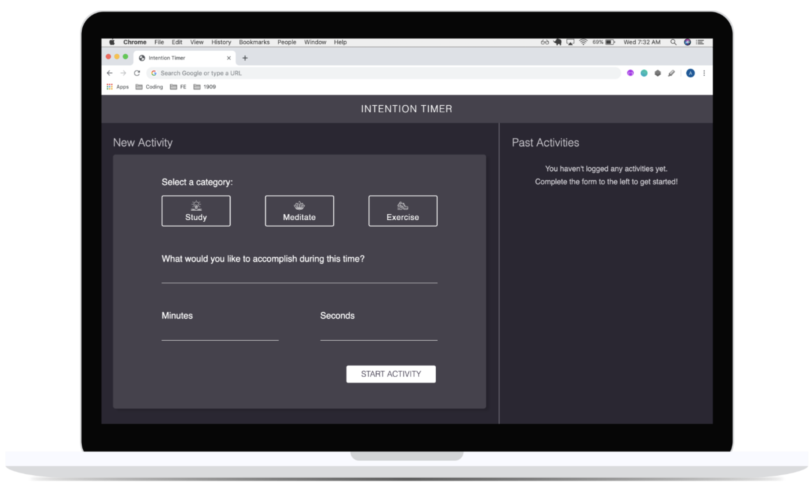

## [Intention Timer](https://frontend.turing.io/projects/module-1/intention-timer-pair.html)
#### Mod 1 Project 2 - Noah Gambee and Johnny Cassidy

For this project, we were given 4 major iterations (as well as a zero-iteration) to follow. The iterations (that we got through) are described below.

The goal of this project is to create an app that allows the user to create specific goals regarding their health that they can tie to an amount of time. The app needs to log the users activity and keep track of how the user has spent time in their activities.

#### Iteration 0 - Zero State
The zero state of this iteration is the HTML and CSS layout (shown below). We could not move on into the next iteration until this one was complete.

#### Iteration 1 - Form Functionality
The goal of this iteration was to begin adding functionality with JS. One part of this was to make the category buttons turn a certain color when selected. We also had to ensure that the minutes/seconds input boxes only accepted numbers and that warnings appear if the forms are submitted without the proper content. Finally, a timer pops up if the "Start Activity" button is clicked and all four forms have valdi content.

#### Iteration 2 - Build an MVP
For iteration 2, we had to ensure that the basic functionality is all complete. Primarily, the timer had to begin counting down following a lick on the 'Start' button. An alert also appears when the timer reaches 00:00.

#### Iteration 3 - Logging Past Activities
This iteration included a function where an activity card appear will appear in the right-side column of the page that represents the activity that was just finished. We were able to log one card with the time, description, and category of the current activity.
